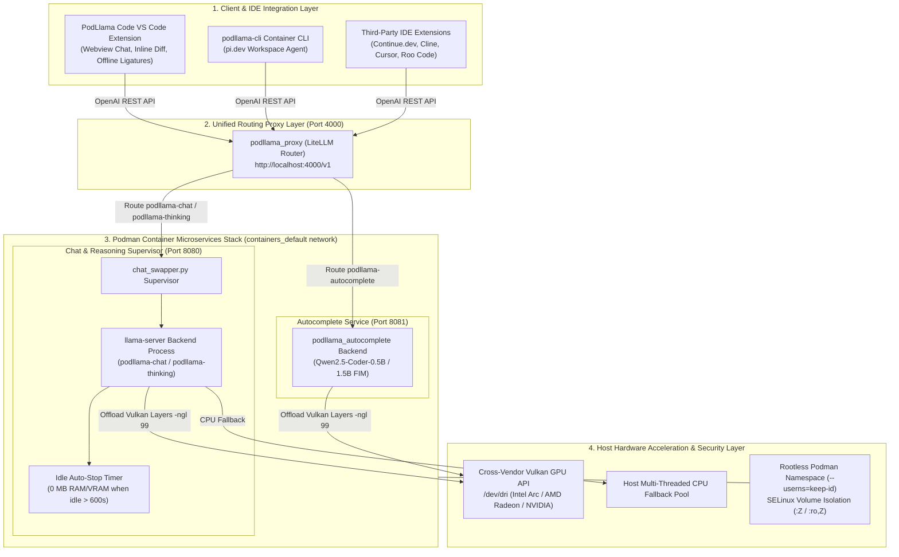

# PodLlama Container Environment

A high-performance, containerized AI coding environment powered by PodLlama running in Podman, with Vulkan GPU Acceleration, LiteLLM Unified Proxy API, Podman Compose Orchestration, and Official pi.dev CLI Integration.

---

## Motivation

Modern AI coding assistants often rely on cloud-hosted LLM APIs, requiring developers to send proprietary source code, secrets, and intellectual property to external servers. Furthermore, running local models can present setup friction, GPU driver incompatibilities, high resource overhead, and security concerns when granting AI agents terminal access.

This project addresses these challenges by delivering an enterprise-ready, self-hosted local AI coding environment built on five core principles:

1. **Complete Data Privacy & Sovereignty**: All code processing and model inference happen 100% locally on your machine. Proprietary source code never leaves your workspace.
2. **Cross-Vendor Hardware Acceleration (Vulkan)**: Uses `llama.cpp-vulkan` to provide high-speed GPU layer offloading across Intel Arc/Iris Xe, AMD Radeon, and NVIDIA GPUs without requiring complex CUDA installations.
3. **Optimized Dual-Model Architecture**: Serves low-latency autocomplete models (0.5B / 1.5B) alongside high-reasoning chat models (7B Instruct) simultaneously, orchestrated behind a single unified LiteLLM Proxy endpoint on port 4000.
4. **Strict Workspace Container Isolation**: Enforces rootless Podman user namespace mapping (`--userns=keep-id`) and SELinux volume isolation (`:z`/`:ro,Z`) so that AI agent file operations and command executions are strictly confined to your workspace directory.
5. **Zero-Compilation Instant Deployment**: Employs `fedora-minimal:latest` base images with prebuilt RPM packages, eliminating lengthy C++ source builds and ensuring fast, reproducible deployments.

---

## Key Features

- **Fedora 44 Minimal & Prebuilt RPMs**: Server containers use official prebuilt Fedora RPM packages (`llama.cpp`, `llama.cpp-vulkan`) installed via `microdnf` inside `fedora-minimal:latest`. This avoids source compilation, saving build time, disk space, and bandwidth.
- **Vulkan GPU Acceleration & Automated Pre-flight Diagnostics**: Checks for hardware Vulkan GPU devices (`vulkaninfo --summary` & `/dev/dri`). Automatically offloads layers to GPU (`-ngl 99`) or falls back gracefully to CPU if no GPU device is detected.
- **Dual Model Support & Dynamic Auto-Swapping**: Run dedicated Chat (`qwen2.5-coder-7b-instruct`) and Autocomplete (`qwen2.5-coder-0.5b` or `1.5b`) models simultaneously. Automatically swaps chat models on demand.
- **Configurable Idle Auto-Stop (0 MB LLM VRAM/RAM Mode)**: Automatically shuts down the chat container backend process after a configurable idle duration (`idle_timeout_seconds`, defaulting to 10 minutes / 600s), freeing 100% of LLM VRAM and host RAM until cold-started by the next request.
- **Unified LiteLLM Proxy API (Port 4000) & Multithreaded Swapper**: Exposes a single, multithreaded OpenAI-compatible API endpoint on port 4000 (`http://localhost:4000/v1`) backed by a `ThreadingHTTPServer` swapper proxy (`chat_swapper.py`) that seamlessly reloads models after idle auto-stop.
- **Official pi.dev & Oh My Pi CLI Integrations**: Packages workspace agent containers for both [pi.dev](https://pi.dev) (`Containerfile.pi` / `@earendil-works/pi-coding-agent`) and [Oh My Pi (omp.sh)](https://omp.sh/) (`Containerfile.omp` / `@oh-my-pi/pi-coding-agent`) built on `node:24-bookworm-slim`.
- **Podman Compose Orchestration**: Easily manage the entire stack (`podllama_chat`, `podllama_autocomplete`, `podllama_proxy`) with a single command (`make service-up`).
---

## System High-Level Architecture

### ASCII Architecture Chart

```text
+---------------------------------------------------------------------------------------------------+
|                                 1. CLIENT & IDE INTEGRATION LAYER                                 |
|                                                                                                   |
|   +--------------------------+    +--------------------------+    +---------------------------+   |
|   | PodLlama Code Extension  |    |   podllama-cli Agent    |    |  Third-Party Extensions   |   |
|   |  (Webview Chat & Diff)   |    |  (pi.dev CLI)  |    |  (Continue / Cline/ Roo)  |   |
|   +------------+-------------+    +------------+-------------+    +-------------+-------------+   |
+----------------|-------------------------------|--------------------------------|-----------------+
                 |                               |                                |
                 +-----------------------+       |       +------------------------+
                                         |       |       |
                                         v       v       v
+---------------------------------------------------------------------------------------------------+
|                               2. UNIFIED ROUTING PROXY LAYER                                      |
|                                                                                                   |
|                 +-----------------------------------------------------------+                     |
|                 |       podllama_proxy (LiteLLM OpenAI-Compatible Router)   |                     |
|                 |                   http://localhost:4000/v1                |                     |
|                 +-----------------------------+-----------------------------+                     |
+-----------------------------------------------|---------------------------------------------------+
                                                |
                       +------------------------+------------------------+
                       |                                                 |
                       | Route: podllama-chat / podllama-thinking        | Route: podllama-autocomplete
                       v                                                 v
+---------------------------------------------------------------------------------------------------+
|                        3. PODMAN CONTAINER MICROSERVICES STACK (containers_default)               |
|                                                                                                   |
|   +---------------------------------------------+   +-----------------------------------------+   |
|   | Chat & Reasoning Supervisor (Port 8080)     |   | Autocomplete Service (Port 8081)        |   |
|   |                                             |   |                                         |   |
|   |  +---------------------------------------+  |   |  +-----------------------------------+  |   |
|   |  | chat_swapper.py (Model Auto-Swapper)  |  |   |  | llama-server Backend              |  |   |
|   |  +-------------------+-------------------+  |   |  | (Qwen2.5-Coder-0.5B / 1.5B FIM)    |  |   |
|   |                      |                      |   |  +-----------------+------------------+  |   |
|   |                      v                      |   +--------------------|--------------------+   |
|   |  +---------------------------------------+  |                        |                        |
|   |  | llama-server (7B / 14B Models)        |  |                        |                        |
|   |  | (Idle Auto-Stop: 0 MB VRAM when idle) |  |                        |                        |
|   |  +-------------------+-------------------+  |                        |                        |
|   +----------------------|----------------------+                        |                        |
+--------------------------|-----------------------------------------------|------------------------+
                           |                                               |
                           +-----------------------+-----------------------+
                                                   |
                                                   v
+---------------------------------------------------------------------------------------------------+
|                        4. HOST HARDWARE ACCELERATION & SECURITY LAYER                             |
|                                                                                                   |
|   +-----------------------------------++----------------------------------++--------------------+   |
|   | Cross-Vendor Vulkan GPU API       || Host Multi-Threaded CPU Pool     || Rootless Podman   |   |
|   | (/dev/dri: Intel / AMD / NVIDIA)  || (Fallback Inference Engine)      || & SELinux (:Z)    |   |
|   +-----------------------------------++----------------------------------++--------------------+   |
+---------------------------------------------------------------------------------------------------+
```

### Mermaid Architecture Diagram



---

## Documentation

Detailed documentation is available in the [`docs/`](./docs) directory:

- **[docs/features.md](./docs/features.md)**: Technical feature overview, Vulkan acceleration, rootless Podman security, and model management.
- **[docs/api.md](./docs/api.md)**: OpenAI-compatible API reference (`/v1/chat/completions`, `/v1/completions`, `/health/liveliness`) and VS Code / Continue integration guides.
- **[docs/design.md](./docs/design.md)**: Architecture design document with Mermaid sequence/flow diagrams, network topology, and SELinux volume isolation.
- **[docs/build_notes.md](./docs/build_notes.md)**: Container multi-stage build pipeline, Vulkan compilation, layer caching, and version pinning notes.

---

## PodLlama Code VS Code Extension

An official extension, **PodLlama Code**, is packaged in [`vscode-extension/out/podllama-code-1.2.1.vsix`](./vscode-extension/out/podllama-code-1.2.1.vsix) to interface directly with the local container stack:

### Features:
- **Interactive Chat Sidebar**: A custom-themed webview panel (matching the Antigravity IDE aesthetic) utilizing local **Fira Sans** and **Fira Code** typography (with programming ligatures) for complete offline privacy.
- **High-Performance Real-Time Stream Renderer**: Powered by a dual-buffer streaming architecture (`streamDataBuffer` & `lastGoodHtml`) and a resilient fallback renderer in `chat.js` that renders live formatted Markdown token-by-token on screen without waiting for generation completion, protecting against CDN script unavailability, packet fragmentation, or missing syntax dependencies.
- **Multi-Field SSE Delta Extractor**: Parses and streams token chunks seamlessly from standard responses (`content`), reasoning traces (`reasoning_content`), and thinking models (`thinking`).
- **Context Attachment Button (`+`)**: Select any text/code file from your workspace and append it directly as a code-block context inside the chat panel.
- **Dynamic Model Selection**: Swap between `podllama-chat` and `podllama-thinking` directly from the input footer dropdown (themed matching your VS Code active workspace theme).
- **Server-Side Personas System (12 CS & AI Personas)**: Backend swapper (`chat_swapper.py`) loads `config/personas.json` into memory on startup and exposes `GET /v1/personas` on port 8080.
- **Dynamic Persona Selection Dropdown & Slash Commands**: Select personas directly from the chat input footer dropdown or type slash shortcuts (`/gate`, `/algo`, `/theory`, `/dl`, `/mlops`, `/safety`, `/architect`, `/dev`, `/sec`, `/devops`, `/paper`, `/review`). System prompts and recommended target models (`podllama-thinking` / `podllama-chat`) are injected automatically into completions.
- **KaTeX LaTeX Math Rendering**: Renders mathematical equations and step-by-step proofs (`$$...$$`, `\[...\]`, `\(...\)`, `$..$`) directly within the chat panel.
- **Editor Context Menu Selection**: Highlight any code in the editor, right-click, and choose **Chat** to automatically reveal the panel and copy the highlighted code selection as context.
- **Side-by-Side Accept/Reject Diff View**: When applying code patches generated by the AI, proposed edits are applied inline and prompted with VS Code's native accept/reject actions (Undo to discard / Save to accept).
- **Real-Time Health & Status Bar Indicator**: Dynamically monitors PodLlama stack availability. Shows active state (`$(sparkle) PodLlama: Active`), thinking state (`$(sync~spin) PodLlama: Thinking...`), or turns grey with `$(circle-slash) PodLlama Unavailable` if the backend service is offline.
- **Inline ghost-text autocomplete** and standard dropdown completion suggestions.
- **Non-Blocking Auto-Summarization Engine**: To prevent model latency degradation during long programming sessions, the extension triggers context summarization asynchronously when a thread exceeds 6 turns. Details are compressed into structured system context without blocking live response generation.

### Installation & Setup:
1. Ensure the Podman backend container stack is running (`make service-up`).
2. Open VS Code.
3. Open the command palette (`Ctrl+Shift+P` / `Cmd+Shift+P` on macOS) and run `Extensions: Install from VSIX...`.
4. Select [`vscode-extension/out/podllama-code-1.2.1.vsix`](./vscode-extension/out/podllama-code-1.2.1.vsix).
5. The extension is ready to use! Configure custom ports/keys if necessary in VS Code's settings under `PodLlama Code`.

---

## Repository Directory Structure

```
.
├── LICENSE                      # GNU General Public License v3.0 (GPLv3)
├── Makefile                     # Root Makefile for build, run, and compose targets
├── .gitignore                   # Excludes GGUF models, temporary downloads, and bytecode
├── config/
│   ├── model_conf.yaml          # Model registry & server configuration (YAML)
│   ├── litellm_config.yaml      # LiteLLM Proxy routing configuration & model aliases
│   └── continue.yaml            # Continue IDE extension configuration template
├── containers/
│   ├── Containerfile.llamacpp    # Fedora 44 Minimal image for llama-server (Vulkan & RPMs)
│   ├── Containerfile.pi         # Node 24 Debian Slim image for official pi.dev workspace agent
│   ├── Containerfile.omp        # Node 24 Debian Slim image for Oh My Pi (omp.sh) workspace agent
│   ├── compose.yaml             # Podman Compose orchestration stack
│   ├── entrypoint-llamacpp.sh   # Server entrypoint (Vulkan GPU check, checksums, auto-download)
│   ├── entrypoint-cli.sh        # Client agent entrypoint (pi.dev)
│   └── entrypoint-omp.sh        # Client agent entrypoint (omp.sh)
├── docs/
│   ├── api.md                   # Complete API specification & IDE setup guide
│   ├── build_notes.md           # Multi-stage build system & compilation caching notes
│   ├── design.md                # System architecture, sequence diagrams & SELinux design
│   └── features.md              # Technical feature overview
├── models/
│   └── .gitkeep                 # Storage directory for local GGUF model files
├── scripts/
│   ├── download_models.py       # Python downloader and SHA256 verifier
│   ├── run_podman.sh            # Podman container launcher script
│   └── run_pi.sh          # Interactive workspace agent launcher script
├── tests/
│   ├── unit_tests.py            # Automated unit test suite
│   └── smoke_tests.py           # Live endpoint smoke test suite (Chat, Autocomplete, Tool Calling)
└── README.md                    # Main repository documentation
```

---

## Downloaded & Supported Models Catalog

The PodLlama container environment manages a curated suite of 6 GGUF LLM models pre-configured in [`config/model_conf.yaml`](file:///home/arp/workspace/grokking.workspace/podllama.git/config/model_conf.yaml) and stored in `./models/`. These models cover low-latency inline autocomplete, multi-turn chat, code editing, function calling, and deep reasoning tasks.

### Models Summary Overview

| Model Identifier / Filename | Parameter Count | Quantization | Disk Size | HuggingFace Repository | Default Role / Alias | Concurrency Mode |
| :--- | :--- | :--- | :--- | :--- | :--- | :--- |
| `qwen2.5-coder-0.5b-instruct-q4_k_m.gguf` | 0.5B | `Q4_K_M` | ~491 MB | [`Qwen/Qwen2.5-Coder-0.5B-Instruct-GGUF`](https://huggingface.co/Qwen/Qwen2.5-Coder-0.5B-Instruct-GGUF) | `podllama-autocomplete` (Port 8081) | Dedicated (Runs in Parallel) |
| `qwen2.5-coder-1.5b-instruct-q4_k_m.gguf` | 1.5B | `Q4_K_M` | ~1.12 GB | [`Qwen/Qwen2.5-Coder-1.5B-Instruct-GGUF`](https://huggingface.co/Qwen/Qwen2.5-Coder-1.5B-Instruct-GGUF) | Optional Autocomplete / Light Chat | Dedicated / Swappable |
| `qwen2.5-coder-3b-instruct-q4_k_m.gguf` | 3.0B | `Q4_K_M` | ~2.10 GB | [`Qwen/Qwen2.5-Coder-3B-Instruct-GGUF`](https://huggingface.co/Qwen/Qwen2.5-Coder-3B-Instruct-GGUF) | Medium Chat / Fast Generation | Swappable (Port 8080) |
| `qwen2.5-coder-7b-instruct-q4_k_m.gguf` | 7.6B | `Q4_K_M` | ~4.68 GB | [`Qwen/Qwen2.5-Coder-7B-Instruct-GGUF`](https://huggingface.co/Qwen/Qwen2.5-Coder-7B-Instruct-GGUF) | `podllama-chat` (Port 8080) | Swappable (Port 8080) |
| `DeepSeek-R1-Distill-Qwen-7B-Q4_K_M.gguf` | 7.6B | `Q4_K_M` | ~4.68 GB | [`unsloth/DeepSeek-R1-Distill-Qwen-7B-GGUF`](https://huggingface.co/unsloth/DeepSeek-R1-Distill-Qwen-7B-GGUF) | `podllama-thinking` (Port 8080) | Swappable (Port 8080) |
| `DeepSeek-R1-Distill-Qwen-14B-Q4_K_M.gguf` | 14.8B | `Q4_K_M` | ~8.99 GB | [`unsloth/DeepSeek-R1-Distill-Qwen-14B-GGUF`](https://huggingface.co/unsloth/DeepSeek-R1-Distill-Qwen-14B-GGUF) | High-Capacity Thinking / Deep Reasoning | Swappable (Port 8080) |

---

### Detailed Model Descriptions

#### 1. Qwen2.5-Coder-0.5B-Instruct (`qwen2.5-coder-0.5b-instruct-q4_k_m.gguf`)
- **Primary Role**: Default Active Autocomplete (`active_autocomplete_model` / `podllama-autocomplete`)
- **Backend Service**: `podllama_autocomplete` (Port 8081)
- **Size & Format**: 491 MB, 4-bit Medium K-quantization (`Q4_K_M`)
- **HuggingFace Repository**: `Qwen/Qwen2.5-Coder-0.5B-Instruct-GGUF`
- **SHA256 Hash**: `1d9614638d18024d0fbb36575a15f1302a3adf044df10345688ec4f6e1c4ff32`
- **Description**: An ultra-compact model optimized for real-time Fill-In-Middle (FIM) code autocomplete. Consumes under 1 GB of VRAM/RAM, delivering sub-100ms inline suggestions during active typing.

#### 2. Qwen2.5-Coder-1.5B-Instruct (`qwen2.5-coder-1.5b-instruct-q4_k_m.gguf`)
- **Primary Role**: Enhanced Autocomplete / High-Speed Lightweight Chat
- **Backend Service**: `podllama_autocomplete` (Port 8081) or `podllama_chat` (Port 8080)
- **Size & Format**: 1.12 GB, 4-bit Medium K-quantization (`Q4_K_M`)
- **HuggingFace Repository**: `Qwen/Qwen2.5-Coder-1.5B-Instruct-GGUF`
- **SHA256 Hash**: `cc324af070c2ecbfd324a30884d2f951a7ff756aba85cb811a6ec436933bb046`
- **Description**: Offers a sweet spot between low latency and higher completion accuracy. Recommended for developers who want richer multi-line inline completions without heavy VRAM utilization.

#### 3. Qwen2.5-Coder-3B-Instruct (`qwen2.5-coder-3b-instruct-q4_k_m.gguf`)
- **Primary Role**: Medium-Tier Code Generation & Fast Chat
- **Backend Service**: `podllama_chat` (Port 8080)
- **Size & Format**: 2.10 GB, 4-bit Medium K-quantization (`Q4_K_M`)
- **HuggingFace Repository**: `Qwen/Qwen2.5-Coder-3B-Instruct-GGUF`
- **SHA256 Hash**: Verified on download
- **Description**: A medium-weight model providing strong coding competence for multi-turn chat and refactoring. Ideal for low-VRAM laptops and Integrated GPU (iGPU) setups.

#### 4. Qwen2.5-Coder-7B-Instruct (`qwen2.5-coder-7b-instruct-q4_k_m.gguf`)
- **Primary Role**: Default Active Chat (`active_chat_model` / `podllama-chat`)
- **Backend Service**: `podllama_chat` (Port 8080)
- **Size & Format**: 4.68 GB, 4-bit Medium K-quantization (`Q4_K_M`)
- **HuggingFace Repository**: `Qwen/Qwen2.5-Coder-7B-Instruct-GGUF`
- **SHA256 Hash**: `509287f78cb4d4cf6b3843734733b914b2c158e43e22a7f4bf5e963800894d3c`
- **Description**: The default flagship coding assistant model. Capable of handling complex multi-file code editing, bug fixing, automated test writing, and structured function/tool calling via `--jinja` prompt formatting.

#### 5. DeepSeek-R1-Distill-Qwen-7B (`DeepSeek-R1-Distill-Qwen-7B-Q4_K_M.gguf`)
- **Primary Role**: Default Active Thinking (`active_thinking_model` / `podllama-thinking`)
- **Backend Service**: `podllama_chat` (Port 8080)
- **Size & Format**: 4.68 GB, 4-bit Medium K-quantization (`Q4_K_M`)
- **HuggingFace Repository**: `unsloth/DeepSeek-R1-Distill-Qwen-7B-GGUF`
- **SHA256 Hash**: Verified on download
- **Description**: A specialized reasoning model distilled from DeepSeek-R1 into Qwen2.5-7B. Excels at step-by-step chain-of-thought analysis, mathematical derivation, algorithmic complexity proofs, and architectural design breakdowns.

#### 6. DeepSeek-R1-Distill-Qwen-14B (`DeepSeek-R1-Distill-Qwen-14B-Q4_K_M.gguf`)
- **Primary Role**: High-Capacity Thinking & Deep Reasoning
- **Backend Service**: `podllama_chat` (Port 8080)
- **Size & Format**: 8.99 GB, 4-bit Medium K-quantization (`Q4_K_M`)
- **HuggingFace Repository**: `unsloth/DeepSeek-R1-Distill-Qwen-14B-GGUF`
- **SHA256 Hash**: Verified on download
- **Description**: The largest reasoning model available in the environment. Designed for hardware configurations with 12GB+ VRAM or 16GB+ System RAM. Delivers superior reasoning accuracy on complex multi-step logical problems.

---

## Quick Start Guide

### 0. Verify System Infrastructure

Verify host system prerequisites (Podman, Python 3, PyYAML, curl, and GPU hardware DRI drivers):

```bash
make check-infra
```

### 1. Download Model Files

Download all configured GGUF model files (0.5B, 1.5B, 7B) into `./models`:

```bash
make download-models
```

Or download only the active chat and autocomplete models:

```bash
make download-active-models
```

### 2. Build Container Images

Build the server and workspace agent images (automatically fetches latest `QwenLM/qwen-code`):

```bash
make build
```

### 3. Launch Full Stack with Podman Compose (Recommended)

Start Chat Server, Autocomplete Server, and LiteLLM Proxy on port 4000:

```bash
make service-up
```

Check status:

```bash
make service-status
```

View live logs:

```bash
make service-logs
```

Stop stack:

```bash
make service-down
```

### 4. Launch Workspace Agent CLI

Run either workspace agent (pi.dev or Oh My Pi) inside your current project folder:

```bash
# Option A: Run Oh My Pi (omp.sh) CLI agent (Default Chat model)
make run-omp
# or pass thinking model directly:
./scripts/run_omp.sh --model podllama-thinking

# Option B: Run official pi.dev CLI agent
make run-pi

# Option C: From inside any target project directory
cd /path/to/your/project
make -C /path/to/podllama.git run-omp WORKSPACE_DIR=$(pwd)

# Option D: Direct script invocation
/path/to/podllama.git/scripts/run_omp.sh /path/to/your/project
```

#### Selecting Models in OMP CLI (`omp.sh`)
- **CLI Flag**: `./scripts/run_omp.sh --model podllama-thinking` or `./scripts/run_omp.sh --model podllama-chat`
- **Environment Variable**: `OPENAI_MODEL=podllama-thinking make run-omp`
- **Interactive**: Type `/model` or `/models` inside an active session to switch dynamically.

---

## LiteLLM Proxy & API Model Selection (Port 4000)

The LiteLLM Proxy runs on `http://localhost:4000/v1`. You can select chat or autocomplete models directly in your API calls:

### 1. Chat Completion API (`podllama-chat`)

```bash
curl http://localhost:4000/v1/chat/completions \
  -H "Content-Type: application/json" \
  -H "Authorization: Bearer sk-local" \
  -d '{
    "model": "podllama-chat",
    "messages": [
      {"role": "user", "content": "Write a python function to compute prime numbers."}
    ]
  }'
```

### 2. Deep Thinking & Reasoning API (`podllama-thinking`)

```bash
curl http://localhost:4000/v1/chat/completions \
  -H "Content-Type: application/json" \
  -H "Authorization: Bearer sk-local" \
  -d '{
    "model": "podllama-thinking",
    "messages": [
      {"role": "user", "content": "Analyze algorithm time complexity for quicksort best vs worst case."}
    ]
  }'
```

> [!NOTE]
> **VRAM/RAM Memory Isolation & Concurrency**:
> - **`podllama-chat` & `podllama-thinking`** both run on backend port `8080` via `chat_swapper.py`. Due to GPU VRAM and system RAM limitations, only **one** chat or thinking model runs in VRAM at a time. Requesting `podllama-thinking` automatically unloads `podllama-chat` (and vice-versa) before cold-starting the target model.
> - **`podllama-autocomplete`** runs on dedicated backend port `8081` and operates **in parallel** with chat/thinking models without triggering swaps.

### 3. Autocomplete Completion API (`podllama-autocomplete`)

```bash
curl http://localhost:4000/v1/completions \
  -H "Content-Type: application/json" \
  -H "Authorization: Bearer sk-local" \
  -d '{
    "model": "podllama-autocomplete",
    "prompt": "def fibonacci(n):\n"
  }'
```

### 4. Query Available Models API (`GET /v1/models`)

Query available role aliases and all registered backend GGUF models directly from the Proxy frontend:

```bash
curl http://localhost:4000/v1/models \
  -H "Authorization: Bearer sk-local"
```

```json
{
  "object": "list",
  "data": [
    { "id": "podllama-chat", "object": "model", "owned_by": "litellm" },
    { "id": "podllama-thinking", "object": "model", "owned_by": "litellm" },
    { "id": "podllama-instruct", "object": "model", "owned_by": "litellm" },
    { "id": "podllama-autocomplete", "object": "model", "owned_by": "litellm" },
    { "id": "qwen2.5-coder-0.5b-instruct-q4_k_m.gguf", "object": "model", "owned_by": "litellm" },
    { "id": "qwen2.5-coder-1.5b-instruct-q4_k_m.gguf", "object": "model", "owned_by": "litellm" },
    { "id": "qwen2.5-coder-3b-instruct-q4_k_m.gguf", "object": "model", "owned_by": "litellm" },
    { "id": "qwen2.5-coder-7b-instruct-q4_k_m.gguf", "object": "model", "owned_by": "litellm" },
    { "id": "DeepSeek-R1-Distill-Qwen-7B-Q4_K_M.gguf", "object": "model", "owned_by": "litellm" },
    { "id": "DeepSeek-R1-Distill-Qwen-14B-Q4_K_M.gguf", "object": "model", "owned_by": "litellm" }
  ]
}
```

### 5. Model Aliases & Registry Map

| Request Model Name / ID | Role | Backend Target Server | Loaded GGUF Model | Concurrency Behavior |
| :--- | :--- | :--- | :--- | :--- |
| `podllama-chat` | Chat | `podllama_chat:8080` | `active_chat_model` (`qwen2.5-coder-7b`) | Auto-swaps on port 8080 (Single active instance) |
| `podllama-thinking` | Thinking / Reasoning | `podllama_chat:8080` | `active_thinking_model` (`DeepSeek-R1-Distill-7B/14B`) | Auto-swaps on port 8080 (Single active instance) |
| `podllama-instruct` | Instruct (Flagship Code) | `podllama_chat:8080` | `qwen2.5-coder-7b-instruct-q4_k_m.gguf` | Auto-swaps on port 8080 (Single active instance) |
| `podllama-autocomplete` | Autocomplete | `podllama_autocomplete:8081` | `active_autocomplete_model` (`qwen2.5-coder-0.5b`) | Dedicated port 8081 (Runs in parallel) |
| `*.gguf` (e.g. `DeepSeek-R1-Distill-Qwen-14B...`) | Direct Model File | `podllama_chat:8080` | Explicit GGUF file | Auto-swaps on port 8080 (Single active instance) |

---

## How to Switch Models

You can switch models dynamically in two ways:

### Method 1: Change Default Active Models in `config/model_conf.yaml`
Edit `config/model_conf.yaml` to select which GGUF model file is loaded for Chat, Autocomplete, or Thinking roles:

```yaml
# Set active model selections:
active_chat_model: qwen2.5-coder-7b-instruct-q4_k_m.gguf
active_autocomplete_model: qwen2.5-coder-0.5b-instruct-q4_k_m.gguf

# Switch thinking model between 7B and 14B:
active_thinking_model: DeepSeek-R1-Distill-Qwen-7B-Q4_K_M.gguf
# active_thinking_model: DeepSeek-R1-Distill-Qwen-14B-Q4_K_M.gguf
```

Then download active models and restart/reload:
```bash
make download-active-models
```

### Method 2: On-Demand API Model Selection (Instant Auto-Swapping)
Send requests directly specifying the exact GGUF model name or alias in your API payload. The `podllama_chat` swapper proxy will automatically stop the current model, load the target GGUF file into Vulkan VRAM, and serve the request:

- **Switch to DeepSeek-R1 14B Thinking**:
  ```bash
  curl http://localhost:4000/v1/chat/completions \
    -H "Content-Type: application/json" \
    -H "Authorization: Bearer sk-local" \
    -d '{
      "model": "DeepSeek-R1-Distill-Qwen-14B-Q4_K_M.gguf",
      "messages": [{"role": "user", "content": "Prove prime number distribution theorem."}]
    }'
  ```

- **Switch to Qwen 3B Chat**:
  ```bash
  curl http://localhost:4000/v1/chat/completions \
    -H "Content-Type: application/json" \
    -H "Authorization: Bearer sk-local" \
    -d '{
      "model": "qwen2.5-coder-3b-instruct-q4_k_m.gguf",
      "messages": [{"role": "user", "content": "Explain async await in Python."}]
    }'
  ```

---

## Model Configuration (`config/model_conf.yaml`)

Edit `config/model_conf.yaml` to change default models or settings:

```yaml
active_chat_model: qwen2.5-coder-7b-instruct-q4_k_m.gguf
active_autocomplete_model: qwen2.5-coder-0.5b-instruct-q4_k_m.gguf
active_thinking_model: DeepSeek-R1-Distill-Qwen-7B-Q4_K_M.gguf
chat_server_port: 8080
autocomplete_server_port: 8081
idle_timeout_seconds: 600
models_dir: /models
workspace_dir: /workspace
vulkan_gpu_layers: 99
context_size: 16384

models:
  qwen2.5-coder-0.5b-instruct-q4_k_m.gguf:
    url: https://huggingface.co/Qwen/Qwen2.5-Coder-0.5B-Instruct-GGUF/resolve/main/qwen2.5-coder-0.5b-instruct-q4_k_m.gguf
    sha256: 1d9614638d18024d0fbb36575a15f1302a3adf044df10345688ec4f6e1c4ff32

  qwen2.5-coder-7b-instruct-q4_k_m.gguf:
    url: https://huggingface.co/Qwen/Qwen2.5-Coder-7B-Instruct-GGUF/resolve/main/qwen2.5-coder-7b-instruct-q4_k_m.gguf
    sha256: 509287f78cb4d4cf6b3843734733b914b2c158e43e22a7f4bf5e963800894d3c

  DeepSeek-R1-Distill-Qwen-7B-Q4_K_M.gguf:
    url: https://huggingface.co/unsloth/DeepSeek-R1-Distill-Qwen-7B-GGUF/resolve/main/DeepSeek-R1-Distill-Qwen-7B-Q4_K_M.gguf
    sha256: auto-verify-on-download

  DeepSeek-R1-Distill-Qwen-14B-Q4_K_M.gguf:
    url: https://huggingface.co/unsloth/DeepSeek-R1-Distill-Qwen-14B-GGUF/resolve/main/DeepSeek-R1-Distill-Qwen-14B-Q4_K_M.gguf
    sha256: auto-verify-on-download
```

---

## VS Code Integration

### Integration Via LiteLLM Unified Proxy (Port 4000)
- **API Provider**: OpenAI / Local Server
- **Base URL**: `http://localhost:4000/v1`
- **Chat Model**: `podllama-chat`
- **Thinking Model**: `podllama-thinking`
- **Autocomplete Model**: `podllama-autocomplete`
- **API Key**: `sk-local`

#### Pre-configured `config/continue.yaml` Template:
A ready-to-use template is provided in [`config/continue.yaml`](./config/continue.yaml):


```yaml
name: PodLlama Local (Vulkan GPU Accelerated)
version: 0.0.1
schema: v1

models:
  - name: PodLlama Chat (Local Vulkan)
    provider: openai
    model: podllama-chat
    apiBase: http://localhost:4000/v1
    apiKey: sk-local
    contextLength: 16384
    roles:
      - chat
      - edit

  - name: PodLlama Thinking (Local Vulkan)
    provider: openai
    model: podllama-thinking
    apiBase: http://localhost:4000/v1
    apiKey: sk-local
    contextLength: 16384
    roles:
      - chat

  - name: PodLlama Autocomplete (Local Vulkan)
    provider: openai
    model: podllama-autocomplete
    apiBase: http://localhost:4000/v1
    apiKey: sk-local
    roles:
      - autocomplete
```

---

## Testing & Verification

The project includes both static unit tests and live endpoint smoke verification:

### 1. Automated Unit Tests (`make unit-tests`)
Validates configuration YAML schemas, script permissions, and container definitions:
```bash
make unit-tests
# or alias:
make test
```

### 2. Live Endpoint Smoke Testing (`make smoke-tests`)
Performs live end-to-end verification against the running Podman stack:
```bash
make smoke-tests
# or alias:
make smoke-test
```

This runs `tests/smoke_tests.py` to perform verbose end-to-end verification across 9 API endpoints:
- **1. Proxy Liveliness**: Probes `http://localhost:4000/health/liveliness`.
- **2. List Models API**: Probes `GET /v1/models` and parses registered model IDs.
- **3. Chat Completions**: Tests `podllama-chat` prompt evaluation tokens (`prompt_tokens`).
- **4. Deep Thinking & Reasoning**: Tests `podllama-thinking` reasoning output.
- **5. Instruct Completions**: Tests `podllama-instruct` code generation output (`qwen2.5-coder-7b-instruct`).
- **6. Chat Model Token Streaming**: Validates real-time SSE chunk streaming output.
- **7. Autocomplete Model Completion**: Tests `podllama-autocomplete` prompt prefill and FIM code output.
- **8. Tool Calling Support**: Validates function tool definitions (`podllama-chat` with `--jinja`) without server error.
- **9. Auto-Stop & Swapper Recovery**: Simulates model server stop (`stop_llama_server()`) and verifies automatic cold-start model reload and completion recovery.

---

## Security & Workspace Isolation

The workspace agent containers (`Containerfile.pi` and `Containerfile.omp`) are launched with:
- `-v "$(pwd):/workspace:Z"`: SELinux-labeled volume mount restricted strictly to the current working directory.
- `--userns=keep-id`: Preserves host user UID/GID without root privileges in workspace.

---

## Makefile Command Reference

| Command | Description |
| :--- | :--- |
| `make check-infra` | Verifies host build and runtime infrastructure (Podman, Python 3, PyYAML, curl, DRI) |
| `make build` | Builds `podllama-server` and `podllama-cli` Podman images |
| `make build-omp` | Builds `podllama-omp` CLI Agent image (omp.sh) |
| `make service-up` | Launches Chat Server, Autocomplete Server & LiteLLM Proxy via Podman Compose |
| `make service-down` | Stops Podman Compose stack |
| `make service-logs` | Displays live logs from all running containers |
| `make service-status` | Checks running container status and health endpoints |
| `make service-restart` | Restarts all Podman Compose stack services |
| `make compose-up` | Alias for `make service-up` |
| `make compose-down` | Alias for `make service-down` |
| `make compose-logs` | Alias for `make service-logs` |
| `make show-live-logs` | Alias for `make service-logs` |
| `make start-server` | Launches Chat Model Server container standalone (Port 8080) |
| `make start-autocomplete-server` | Launches Autocomplete Model Server container standalone (Port 8081) |
| `make start-all` | Launches both standalone model servers |
| `make stop-server` | Stops all standalone server containers |
| `make service-status` | Checks running container status and health endpoints |
| `make run-pi` | Runs pi.dev workspace agent client in current directory |
| `make run-omp` | Runs Oh My Pi (omp.sh) workspace agent client in current directory |
| `make unit-tests` | Runs automated unit test suite (config schema, script permissions, container files) |
| `make test` | Alias for `make unit-tests` |
| `make smoke-tests` | Runs live smoke test on Chat (streaming), Autocomplete, and Tool Calling endpoints |
| `make smoke-test` | Alias for `make smoke-tests` |
| `make download-active-models` | Downloads active chat and autocomplete models into models directory |
| `make download-models` | Downloads ALL configured GGUF models into models directory |
| `make run-pi` | Runs official pi.dev workspace agent CLI in current workspace directory |
| `make run-pod` | Runs server and client together inside a single Podman pod |
| `make clean` | Cleans Podman container images and temporary files |

---

## License

This project is licensed under the [GNU General Public License v3.0 (GPL-3.0)](./LICENSE).

