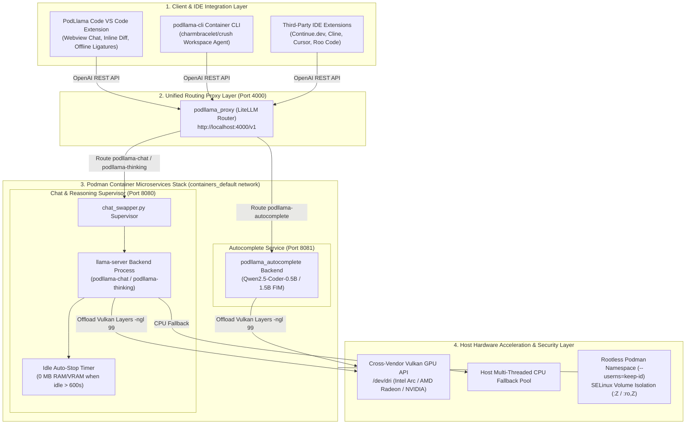
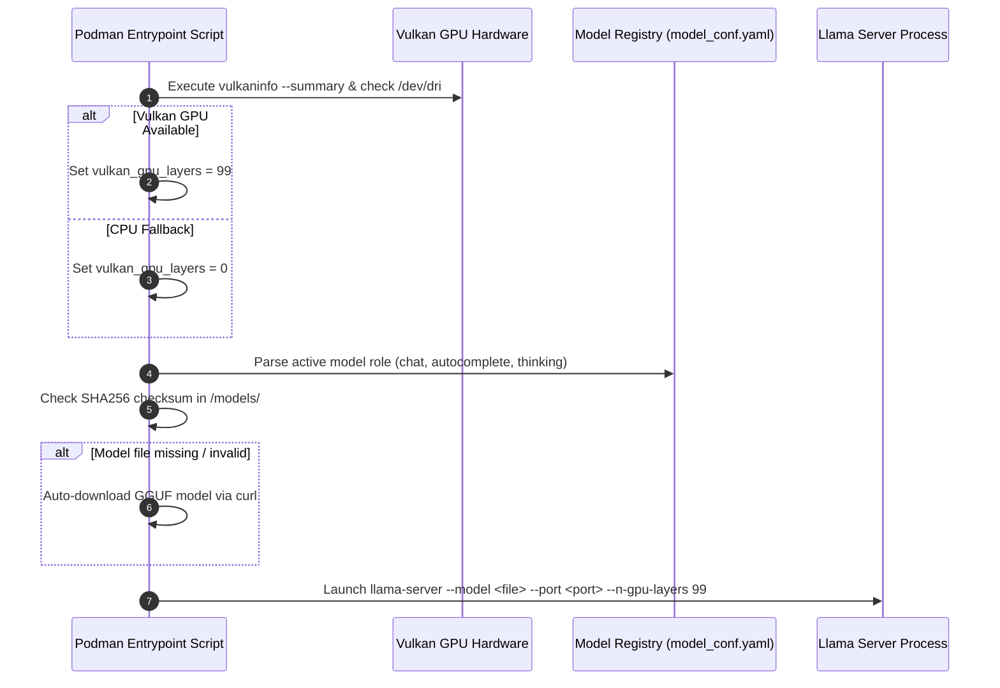
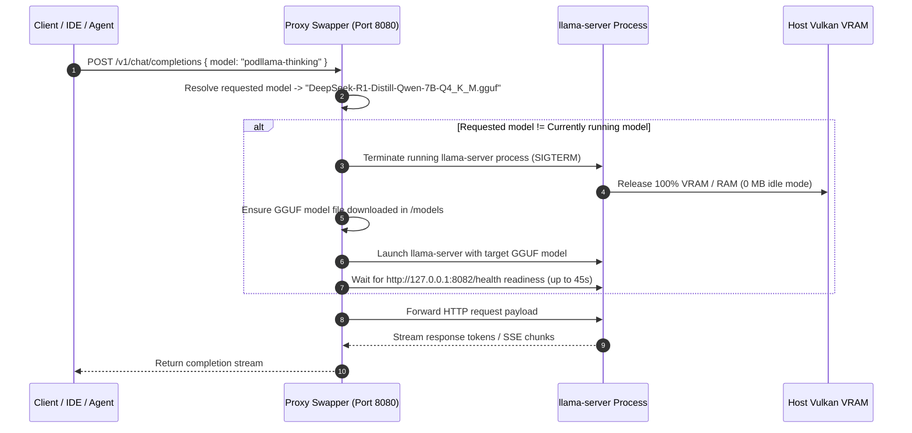
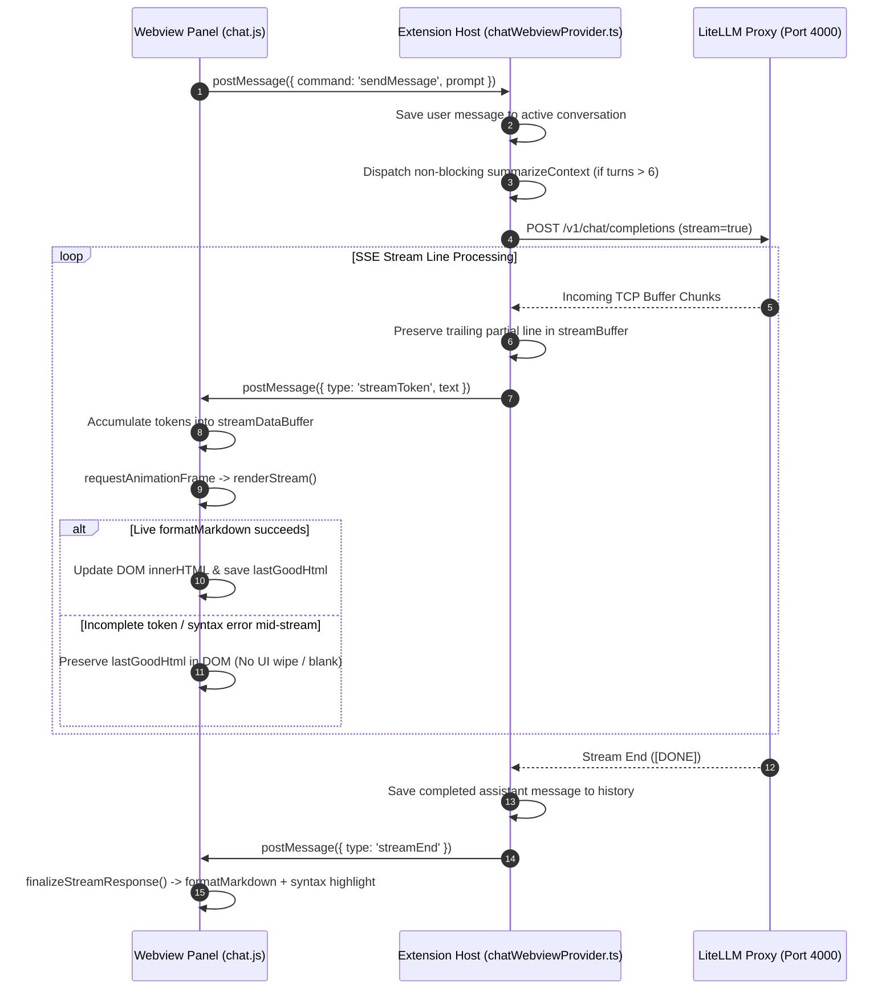

# Architecture & System Design Document

This document outlines the architecture, container orchestration, network flow, security boundary, and configuration schemas of the **PodLlama Container Environment**.

---

## 1. High-Level Architecture Overview

The system employs a containerized microservices architecture organized into four main operational layers:

1. **Client / Workspace Layer**: VS Code Extension (PodLlama Code), terminal workspace agent (`qwen-client`), or third-party IDE extensions (Continue.dev, Cline, Cursor).
2. **Unified Routing Proxy Layer**: `podllama_proxy` listening on host port `4000`.
3. **Backend Model Server & Supervisor Layer**: Isolated `llama-server` instances managed by `chat_swapper.py` on port `8080` (Chat/Reasoning) and port `8081` (Autocomplete).
4. **Hardware Acceleration & Security Layer**: Vulkan GPU API (`/dev/dri`), rootless Podman user namespaces, and SELinux volume isolation.



---

## 2. Container Hierarchy & Component Responsibilities

### 2.1 `podllama_proxy`
- **Image**: `ghcr.io/berriai/litellm:main-latest`
- **Exposed Port**: `4000:4000`
- **Role**: Provides a single OpenAI-compatible HTTP interface (`/v1/chat/completions`, `/v1/completions`, `/v1/models`). Translates incoming requests to appropriate upstream model server backends based on `config/litellm_config.yaml`.

### 2.2 `podllama_chat`
- **Image**: `podllama-server:latest` (built from `containers/Containerfile.llamacpp`)
- **Port**: `8080` (internal service port)
- **Role**: Primary Chat, high-reasoning code generation, complex refactoring.

### 2.3 `podllama_autocomplete`
- **Image**: `podllama-server:latest` (built from `containers/Containerfile.llamacpp`)
- **Internal Port**: `8081`
- **Role**: Runs `llama-server` configured with `MODEL_ROLE=autocomplete`. Loads `qwen2.5-coder-0.5b` or `1.5b` for low-latency FIM inline autocomplete.

### 2.4 `qwen-client`
- **Image**: `qwen-client:latest` (built from `containers/Containerfile.crush`)
- **Role**: Standalone interactive workspace agent container pre-packaged with official `QwenLM/qwen-code` CLI tool. Mounted directly to the project root directory.

---

## 3. Network Topology & Container Security

```mermaid
graph LR
    subgraph Host Network
        HostIP["Host 127.0.0.1:4000"]
    end

    subgraph Podman User Network (containers_default)
        LiteLLM["podllama_proxy:4000"]
        Chat["podllama_chat:8080"]
        Auto["podllama_autocomplete:8081"]
    end

    HostIP -->|Port Forward 4000| LiteLLM
    LiteLLM -->|Internal DNS| Chat
    LiteLLM -->|Internal DNS| Auto
```

### Security Controls

- **SELinux Isolation (`:Z` & `:ro,Z`)**:
  - Model directory volume: `${MODELS_DIR}:/models:Z`
  - LiteLLM config file: `../config/litellm_config.yaml:/app/config.yaml:ro,Z`
- **Rootless User Namespace (`--userns=keep-id`)**: Maps host UID/GID directly into client containers to prevent root privilege escalation while granting local file write access to project workspace directories.
- **Internal Backend Isolation**: Backend `podllama_chat` and `podllama_autocomplete` services do not publish host ports in Compose mode, preventing direct unauthenticated host access.

---

## 4. Initialization & Model Auto-Swapping Flow

### 4.1 Server Startup Diagnostics


### 4.2 On-Demand Model Switching Mechanism (`chat_swapper.py`)

When an incoming API request targets a different model (e.g., switching from `podllama-chat` to `podllama-thinking` or requesting `DeepSeek-R1-Distill-Qwen-14B-Q4_K_M.gguf` directly), the proxy automatically performs an on-demand model swap:



---

## 5. Configuration Schemas

### 5.1 `config/model_conf.yaml`
Centralized YAML schema specifying active models, URLs, ports, and checksums:

```yaml
active_chat_model: qwen2.5-coder-7b-instruct-q4_k_m.gguf
active_autocomplete_model: qwen2.5-coder-0.5b-instruct-q4_k_m.gguf
active_thinking_model: DeepSeek-R1-Distill-Qwen-7B-Q4_K_M.gguf
chat_server_port: 8080
autocomplete_server_port: 8081
idle_timeout_seconds: 600
vulkan_gpu_layers: 99
context_size: 8192

models:
  qwen2.5-coder-0.5b-instruct-q4_k_m.gguf:
    name: Qwen2.5-Coder-0.5B-Instruct (Q4_K_M)
    repo: Qwen/Qwen2.5-Coder-0.5B-Instruct-GGUF
    url: https://huggingface.co/Qwen/Qwen2.5-Coder-0.5B-Instruct-GGUF/resolve/main/qwen2.5-coder-0.5b-instruct-q4_k_m.gguf
    sha256: 1d9614638d18024d0fbb36575a15f1302a3adf044df10345688ec4f6e1c4ff32

  qwen2.5-coder-1.5b-instruct-q4_k_m.gguf:
    name: Qwen2.5-Coder-1.5B-Instruct (Q4_K_M)
    repo: Qwen/Qwen2.5-Coder-1.5B-Instruct-GGUF
    url: https://huggingface.co/Qwen/Qwen2.5-Coder-1.5B-Instruct-GGUF/resolve/main/qwen2.5-coder-1.5b-instruct-q4_k_m.gguf
    sha256: cc324af070c2ecbfd324a30884d2f951a7ff756aba85cb811a6ec436933bb046

  qwen2.5-coder-3b-instruct-q4_k_m.gguf:
    name: Qwen2.5-Coder-3B-Instruct (Q4_K_M)
    repo: Qwen/Qwen2.5-Coder-3B-Instruct-GGUF
    url: https://huggingface.co/Qwen/Qwen2.5-Coder-3B-Instruct-GGUF/resolve/main/qwen2.5-coder-3b-instruct-q4_k_m.gguf
    sha256: auto-verify-on-download

  qwen2.5-coder-7b-instruct-q4_k_m.gguf:
    name: Qwen2.5-Coder-7B-Instruct (Q4_K_M)
    repo: Qwen/Qwen2.5-Coder-7B-Instruct-GGUF
    url: https://huggingface.co/Qwen/Qwen2.5-Coder-7B-Instruct-GGUF/resolve/main/qwen2.5-coder-7b-instruct-q4_k_m.gguf
    sha256: 509287f78cb4d4cf6b3843734733b914b2c158e43e22a7f4bf5e963800894d3c

  DeepSeek-R1-Distill-Qwen-7B-Q4_K_M.gguf:
    name: DeepSeek-R1-Distill-Qwen-7B (Q4_K_M)
    repo: unsloth/DeepSeek-R1-Distill-Qwen-7B-GGUF
    url: https://huggingface.co/unsloth/DeepSeek-R1-Distill-Qwen-7B-GGUF/resolve/main/DeepSeek-R1-Distill-Qwen-7B-Q4_K_M.gguf
    sha256: auto-verify-on-download

  DeepSeek-R1-Distill-Qwen-14B-Q4_K_M.gguf:
    name: DeepSeek-R1-Distill-Qwen-14B (Q4_K_M)
    repo: unsloth/DeepSeek-R1-Distill-Qwen-14B-GGUF
    url: https://huggingface.co/unsloth/DeepSeek-R1-Distill-Qwen-14B-GGUF/resolve/main/DeepSeek-R1-Distill-Qwen-14B-Q4_K_M.gguf
    sha256: auto-verify-on-download
```

### 5.2 `config/litellm_config.yaml`
LiteLLM model aliases and routing table:

```yaml
model_list:
  - model_name: podllama-chat
    litellm_params:
      model: custom_openai/qwen2.5-coder
      api_base: http://podllama_chat:8080/v1
      api_key: sk-local

  - model_name: podllama-autocomplete
    litellm_params:
      model: text-completion-openai/qwen2.5-coder
      api_base: http://podllama_autocomplete:8081/v1
      api_key: sk-local

  - model_name: podllama-thinking
    litellm_params:
      model: custom_openai/qwen2.5-coder
      api_base: http://podllama_chat:8080/v1
      api_key: sk-local

general_settings:
  master_key: sk-local
  disable_master_key_auth: true

router_settings:
  num_retries: 3
  timeout: 120

---

## 6. VS Code Extension Streaming & Webview Architecture

The companion **PodLlama Code** VS Code extension employs an asynchronous, dual-buffered event architecture to deliver low-latency chat streaming while protecting against network packet fragmentation and DOM re-render glitches:



### Key Reliability Safeguards:
1. **SSE Line Buffer (`streamBuffer`)**: The extension host maintains a `streamBuffer` across raw HTTP response `data` events, splitting only on `\n` boundaries and preserving partial trailing lines to prevent JSON syntax errors from packet fragmentation.
2. **Decoupled Dual-Buffer Rendering**: `chat.js` maintains a raw ingestion buffer (`streamDataBuffer`) and a formatted HTML presentation buffer (`lastGoodHtml`), decoupling network token throughput from browser DOM paint cycles.
3. **DOM Node Persistence**: Active streaming turns use direct JavaScript DOM element handles (`activeStreamContentElement`) rather than static CSS ID selectors, preventing ID collisions or node detachment when workspace sessions refresh.
4. **Asynchronous Context Summarization**: Conversations exceeding 6 turns trigger context summarization in the background without blocking the primary streaming request.
