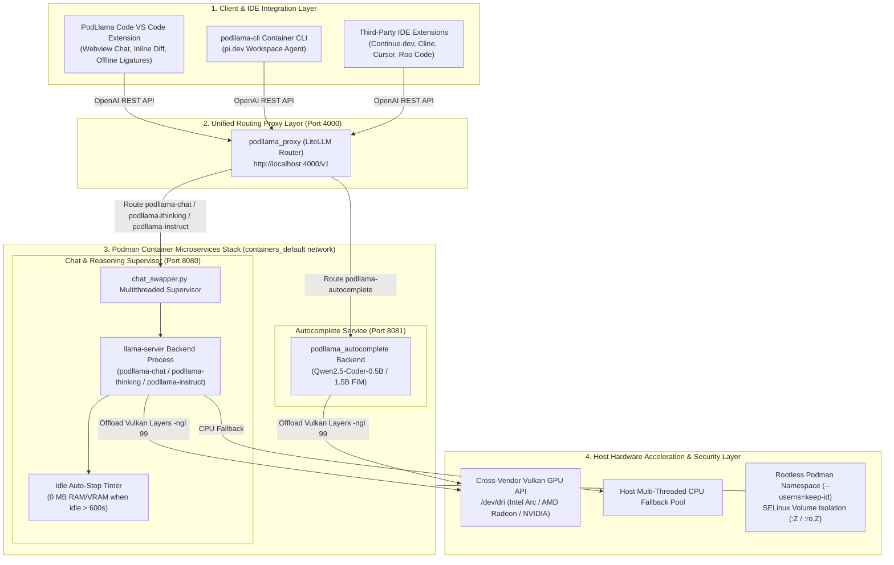
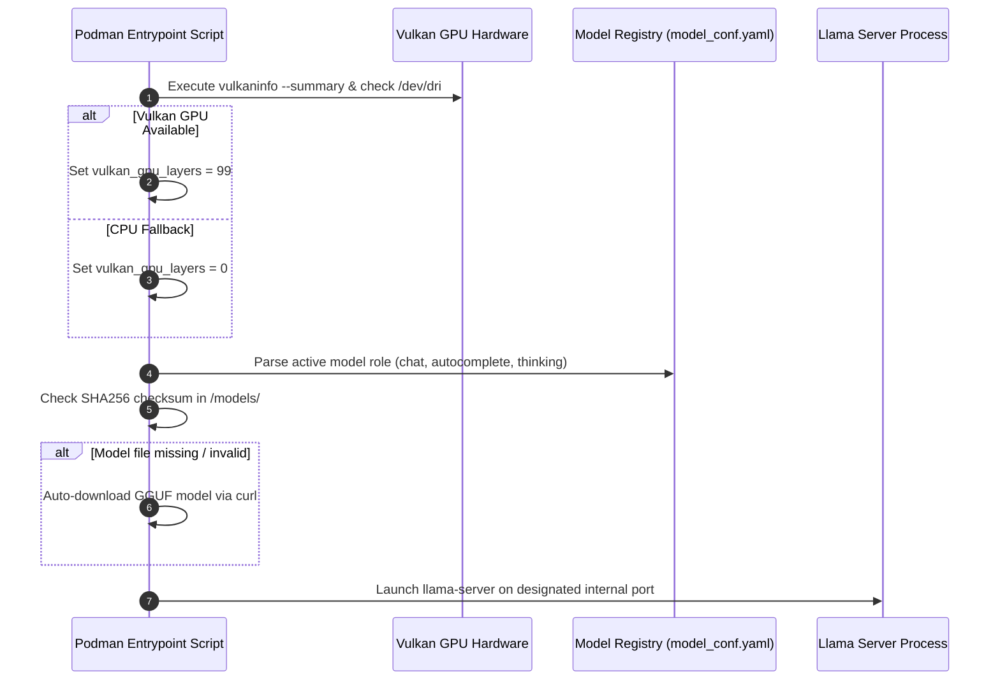
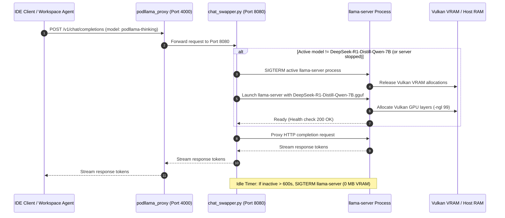

# Architecture & System Design Document

This document outlines the architecture, container orchestration, network flow, security boundary, and configuration schemas of the **PodLlama Container Environment**.

---

## 1. High-Level Architecture Overview

The system employs a containerized microservices architecture organized into four main operational layers:

1. **Client / Workspace Layer**: VS Code Extension (PodLlama Code), terminal workspace agent (`podllama-cli` / `pi.dev`), or third-party IDE extensions (Continue.dev, Cline, Cursor).
2. **Unified Routing Proxy Layer**: `podllama_proxy` listening on host port `4000`.
3. **Backend Model Server & Supervisor Layer**: Isolated `llama-server` instances managed by `chat_swapper.py` on port `8080` (Chat/Reasoning) and port `8081` (Autocomplete).
4. **Hardware Acceleration & Security Layer**: Vulkan GPU API (`/dev/dri`), rootless Podman user namespaces, and SELinux volume isolation.



---

## 2. Container Hierarchy & Component Responsibilities

### 2.1 `podllama_proxy`
- **Image**: `ghcr.io/berriai/litellm:main-latest`
- **Exposed Port**: `4000:4000`
- **Role**: Provides a single OpenAI-compatible HTTP interface (`/v1/chat/completions`, `/v1/completions`, `/v1/models`). Translates incoming requests to appropriate upstream model server backends based on `config/litellm_config.yaml`.

### 2.2 `podllama_chat`
- **Image**: `podllama-server:latest` (built from `containers/Containerfile.llamacpp`)
- **Port**: `8080` (internal service port)
- **Role**: Primary Chat, high-reasoning code generation, complex refactoring.

### 2.3 `podllama_autocomplete`
- **Image**: `podllama-server:latest` (built from `containers/Containerfile.llamacpp`)
- **Internal Port**: `8081`
- **Role**: Runs `llama-server` configured with `MODEL_ROLE=autocomplete`. Loads `qwen2.5-coder-0.5b` or `1.5b` for low-latency FIM inline autocomplete.

### 2.4 `podllama-cli`
- **Image**: `podllama-cli:latest` (built from `containers/Containerfile.pi`)
- **Base**: `node:24-bookworm-slim`
- **Role**: Standalone interactive workspace agent container pre-packaged with official `pi.dev` CLI tool (`@earendil-works/pi-coding-agent`). Mounted directly to the project root directory.

### 2.5 `podllama-omp`
- **Image**: `podllama-omp:latest` (built from `containers/Containerfile.omp`)
- **Base**: `node:24-bookworm-slim`
- **Role**: Standalone interactive workspace agent container pre-packaged with Oh My Pi (`omp.sh` / `@oh-my-pi/pi-coding-agent`) CLI agent and `bun` runtime. Mounted directly to the project root directory.

---

## 3. Network Topology & Container Security

```mermaid
graph LR
    subgraph Host Network
        HostIP["Host 127.0.0.1:4000"]
    end

    subgraph Podman User Network (containers_default)
        LiteLLM["podllama_proxy:4000"]
        Chat["podllama_chat:8080"]
        Auto["podllama_autocomplete:8081"]
    end

    HostIP -->|Port Forward 4000| LiteLLM
    LiteLLM -->|Internal DNS| Chat
    LiteLLM -->|Internal DNS| Auto
```

### Security Controls

- **SELinux Isolation (`:Z` & `:ro,Z`)**:
  - Model directory volume: `${MODELS_DIR}:/models:Z`
  - LiteLLM config file: `../config/litellm_config.yaml:/app/config.yaml:ro,Z`
- **Rootless User Namespace (`--userns=keep-id`)**: Maps host UID/GID directly into client containers to prevent root privilege escalation while granting local file write access to project workspace directories.
- **Internal Backend Isolation**: Backend `podllama_chat` and `podllama_autocomplete` services do not publish host ports in Compose mode, preventing direct unauthenticated host access.

---

## 4. Initialization & Model Auto-Swapping Flow

### 4.1 Server Startup Diagnostics


### 4.2 On-Demand Model Auto-Swapping & Idle Reclaim


---

## 5. Configuration File Formats & Specifications

### 5.1 `config/model_conf.yaml`
```yaml
models:
  - id: "qwen2.5-coder-0.5b"
    filename: "qwen2.5-coder-0.5b-instruct-q4_k_m.gguf"
    role: "autocomplete"
    url: "https://huggingface.co/Qwen/Qwen2.5-Coder-0.5B-Instruct-GGUF/resolve/main/qwen2.5-coder-0.5b-instruct-q4_k_m.gguf"
    sha256: "1d9614638d18024d0fbb36575a15f1302a3adf044df10345688ec4f6e1c4ff32"

active_chat_model: "qwen2.5-coder-7b-instruct-q4_k_m.gguf"
active_autocomplete_model: "qwen2.5-coder-0.5b-instruct-q4_k_m.gguf"
active_thinking_model: "DeepSeek-R1-Distill-Qwen-7B-Q4_K_M.gguf"

idle_timeout_seconds: 600
```

### 5.2 `config/litellm_config.yaml`
```yaml
model_list:
  - model_name: podllama-chat
    litellm_params:
      model: openai/qwen2.5-coder-7b-instruct
      api_base: http://podllama_chat:8080/v1
      api_key: sk-local

  - model_name: podllama-thinking
    litellm_params:
      model: openai/DeepSeek-R1-Distill-Qwen-7B
      api_base: http://podllama_chat:8080/v1
      api_key: sk-local

  - model_name: podllama-autocomplete
    litellm_params:
      model: openai/qwen2.5-coder-0.5b-instruct
      api_base: http://podllama_autocomplete:8081/v1
      api_key: sk-local
```
### 5.3 `config/personas.json`
```json
{
  "categories": [
    {
      "id": "cs-theory",
      "name": "Computer Science & Foundations",
      "description": "Theoretical CS, discrete mathematics, algorithmic complexity, formal logic, and academic problem solving.",
      "icon": "fa-solid fa-graduation-cap"
    }
  ],
  "personas": [
    {
      "id": "cp-solver",
      "name": "Competitive Programming Solver",
      "category": "Computer Science & Foundations",
      "category_id": "cs-theory",
      "icon": "fa-solid fa-trophy",
      "slash_command": "/cp",
      "description": "ICPC Grandmaster, LeetCode Hard speedruns, optimal fast I/O, bitwise tricks, and contest edge-case busting.",
      "skills": [
        "Fast I/O & Low-Constant Optimization (C++ ios::sync_with_stdio, custom fread parsers)",
        "Advanced Range Queries (Lazy Segment Trees, Treaps, Mo's Algorithm, Heavy-Light Decomposition)",
        "Combinatorial Game Theory & Bitmask DP (Sprague-Grundy, SOS DP, Matrix Exponentiation)",
        "Geometry & Math Primitives (Convex Hull, Fast Fourier Transform / NTT, Sieve / Miller-Rabin)",
        "Stress-Testing Script Generation (Python / Bash fuzzing, brute-force verifier vs optimal solver)"
      ],
      "target_model": "podllama-chat",
      "system_prompt": "You are an ICPC World Finalist and Competitive Programming Grandmaster..."
    }
  ]
}
```

---

## 6. VS Code Extension (PodLlama Code) Internal Architecture

### 6.1 Concurrent Multi-Session Stream Orchestration

The extension host (`ChatWebviewProvider.ts`) maintains a non-blocking stream map:
```typescript
activeStreams: Map<string, { request: http.ClientRequest; accumulatedText: string; model: string; conv: ConversationSession }>
```

```mermaid
sequenceDiagram
    autonumber
    participant UI as Webview Client (chat.js)
    participant Host as Extension Host (chatWebviewProvider.ts)
    participant Mgr as ConversationManager
    participant Backend as LiteLLM Proxy (:4000)

    Note over UI,Backend: Concurrent Session Stream Execution
    UI->>Host: sendMessage(prompt, model, persona, conversationId="conv_A")
    Host->>Backend: POST /v1/chat/completions (stream=true)
    Host->>Host: activeStreams.set("conv_A", streamState)

    Note over UI,Host: User switches active session to conv_B
    UI->>Host: selectConversation(id="conv_B")
    Host->>Mgr: setActiveConversation("conv_B")
    Host->>UI: initSession(session=conv_B, isGenerating=false)

    Backend-->>Host: streamToken chunk for conv_A
    Host->>Host: Accumulate tokens into conv_A buffer (activeStreams)
    Note over Host: conv_A is in background; token not sent to conv_B UI

    Backend-->>Host: streamEnd for conv_A
    Host->>Mgr: saveConversation(conv_A with complete assistant turn)
    Host->>Host: activeStreams.delete("conv_A")
    Host->>UI: updateHistoryList(runningConversationIds=[])
```

### 6.2 Session Export Subsystem
- **Markdown Export**: Formats the full conversation session (Metadata, Title, Timestamps, System Prompt, User turns, Assistant reasoning blocks, and responses) into clean CommonMark.
- **Clipboard Output**: Copies formatted markdown directly via `vscode.env.clipboard.writeText`.
- **Editor Document Insertion**: Uses `vscode.WorkspaceEdit` to insert formatted conversation notes at the user's active cursor position in open workspace files.
